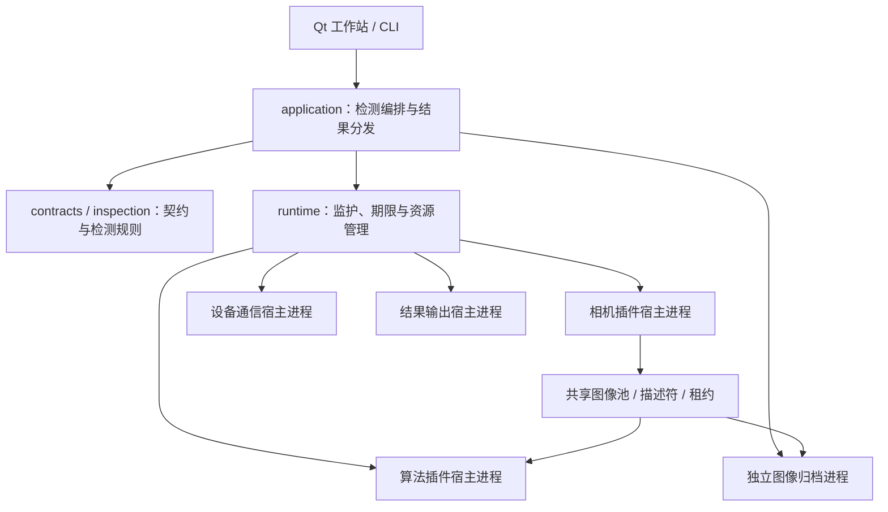

# VisionInspectionFramework

**基于 C++20 与 Qt 的工业视觉检测上位机框架。**

为采集、算法、设备通信和结果输出提供可扩展的接入方式，通过独立插件进程、运行监护、有界通信和共享图像机制，帮助开发者构建自己的检测应用。

仓库同时提供 Qt 工作站、命令行演示、故障测试和 Agent 开发 Skill。可以先运行模拟工位，理解检测链路，再逐步接入自己的设备与业务。

> **当前阶段：0.2.0 开发版，Windows 优先。** 已完成多进程模拟检测和部分真实软件依赖的验证；真实相机、现场 PLC、完整生产恢复及正式打包尚未验收。Production 模式保持禁用，不应直接用于产线控制。项目自身的开源许可证尚未选定。

## 微信交流群

欢迎扫码加入微信交流群，一起交流工业视觉、上位机开发和框架使用，分享问题与实践经验。

**扫码加入群聊**


**无法直接扫码入群？添加我的微信，我拉你进群。** 添加好友时请备注「视觉框架」。


## 项目定位

本项目面向需要开发工业视觉上位机的开发者，提供可复用的运行机制、业务接口和示例，而不是开箱即用的完整视觉检测产品。

适合用于：

- 构建包含采集、推理、判定、追溯和外部输出的检测应用。
- 将相机 SDK、算法库或输出实现封装为插件，减少对主程序的直接耦合。
- 在模拟环境中验证超时、断线、插件崩溃和输出挂起等行为。
- 通过开发 Skill 和模板，在独立业务目录中复用框架。

当前不提供完整低代码编辑器、通用算法库或经过产线验收的设备控制方案。Qt 工作站是框架的示例应用，界面风格和业务流程可在应用层扩展。

## 核心能力

- **插件与进程监护**：Camera、Algorithm、Communication、ResultOutput 接入公共宿主，提供进程生命周期管理、心跳、期限和有限恢复机制。
- **有界运行资源**：队列、消息、图像池和运行诊断有容量约束，处理超时、背压与资源归还。
- **共享图像**：通过图像描述符和租约移交数据，支持读访问、超时隔离和进程退出后的回收。
- **检测业务模型**：区分任务执行、检测质量、存储状态和输出交付，使用工件及任务身份关联结果。
- **算法与回放**：提供基础算法示例和 ONNX Runtime CPU 推理路径，覆盖目标检测、分类、实例分割及离线回放。
- **配方与追溯**：已有配方校验、原子保存、排空切换、回退、有效配置快照、SQLite 结果和本地图像归档能力。
- **输出扩展**：文件、SQLite、只读 HTTP REST/SSE 输出插件，以及持久分发、交付确认和对象存储工具。
- **Agent 开发支持**：提供应用与结果输出插件模板、接口兼容检查、构建及验证脚本。

这些能力的完成范围见下表；接口存在、模拟通过和现场可用是不同的验收阶段。

## 架构概览



图中表示职责和工作进程边界，不表示当前 UI 已作为独立客户端与常驻主控服务完全分离。

- `runtime` 管运行机制，`inspection` 管检测含义，`application` 管业务编排，插件管具体接入。
- 公共契约和插件 SDK 不依赖 Qt；Qt 用于工作站及部分进程、事件、通信适配。关闭 GUI 不等于完整后台不依赖 Qt。
- 控制消息与大图像数据分开传递，图像读取必须遵守租约生命周期。
- 进程隔离提供故障处置边界，不是恶意代码沙箱，也不能隔离所有驱动、操作系统和硬件故障。

详细设计见 [架构设计](架构设计.md) 和 [开发计划及要求](开发计划及要求.md)。

## 当前支持情况

| 能力 | 当前实现 | 验证边界与待完成项 |
|---|---|---|
| 运行平台 | Windows x64 / MSVC v143 | Linux 核心预设已提供，尚未完成验证；不是整套跨平台交付 |
| Qt 工作站 | Qt 6.8.3 Widgets，多进程状态与模型工具 | 开发演示界面，非正式发行包 |
| 相机采集 | 模拟相机插件、固定图及序列 PGM/PPM 回放、双相机协调 | 真实 MVS 相机尚未验收 |
| 算法 | 基础亮度示例，ONNX CPU 检测/分类/实例分割 | 模型为原创契约测试样例，不能代表实际缺陷识别精度 |
| 设备通信 | 模拟 PLC、Modbus TCP 软件适配 | 已有 TCP 对端测试，未完成现场 PLC 验收 |
| 配方 | 校验、保存、切换、回退及快照接口 | 不代表所有操作均已集成到工作站页面 |
| 本地追溯 | SQLite、原图归档、trace 查询、JSONL/CSV | 完整生产恢复和断电验证尚未完成 |
| 对象存储 | RustFS 上传/续传工具及集成验证 | 工位原图尚未自动上传；掩码持久化和远端对账待补；ObjectStorage 宿主接入未完成 |
| 网络输出 | 独立 HTTP REST/SSE 输出插件 | 只读查询/事件输出，不是完整远程控制 API；不是远端消费确认 |
| 扩展开发 | 公共宿主、插件契约、应用和输出模板 | 模板以模拟 Demo 为范围，不是生产应用生成器 |

完整进展及未关闭事项以 [开发进度及计划](开发进度及计划.md) 为准。

## 快速开始

### 1. 准备 Windows 开发环境

当前路径针对已经准备好依赖的开发环境，尚未提供完整的一键安装流程。

| 依赖 | 当前要求或用途 |
|---|---|
| Visual Studio 2022 | C++ 桌面开发工具、x64 MSVC v143、Windows SDK；便捷脚本使用 VS 自带 CMake |
| CMake | 3.25 或以上 |
| Qt Base | 固定 6.8.3，MSVC 2022 x64 动态库；Core、Network、Gui、Widgets |
| ONNX Runtime | 当前 Windows SDK 基线 1.30.0 |
| 原生依赖 | SQLite、libcurl 及其 CMake 配置、cpp-httplib 头文件等，按锁定清单准备 |
| JSON / 测试库 | nlohmann/json 3.12.0、doctest 2.5.3 |
| Node.js | 执行构建和全量验证脚本，不是框架运行时依赖 |
| Python | 测试/工具需要 Python 3；Skill 脚本要求 3.9+，协议检查还需要 jsonschema |
| RustFS / curl.exe | 全量验证会启动本地 RustFS 并执行对象存储测试 |

依赖版本和来源见 [artifacts.lock.json](dependencies/artifacts.lock.json)。该文件是来源记录，不是自动安装器。

当前构建默认查找以下本地目录，SDK 不随源码仓库提供：

```text
开发环境/SDK/
├── Qt/6.8.3/msvc2022_64/
├── ONNXRuntime/onnxruntime-win-x64-1.30.0/
├── native/
│   ├── include/              第三方头文件
│   └── lib/                  sqlite3.lib、libcurl 及相关 CMake 配置
└── RustFS/rustfs.exe         全量对象存储测试使用
```

依赖目录必须包含与工具链、架构和运行库配置匹配的文件。不要只创建空目录代替安装。

**当前 Windows 构建即使关闭 GUI，也会配置 ONNX Runtime、SQLite 和 libcurl 相关目标。** `windows-core` 不依赖 Qt，但不是无第三方 SDK 的最小构建。`VISION_ALLOW_DOWNLOADS=ON` 仅解决脚本支持的 JSON/doctest 下载，不会自动准备全部依赖。

### 2. 构建并验证

在项目根目录执行，前提是上述 SDK 已准备好：

```powershell
node tools/build.cjs windows-all
```

该命令依次构建并验证核心、GUI、IPC 配置，再运行协议检查及本地 RustFS 集成测试。日志和汇总写入 `out/validation/`，任一组失败则整体失败。可用 `VISION_PYTHON` 指定检查脚本使用的 Python。

单独构建、定位问题时可以使用：

```powershell
node tools/build.cjs windows-gui
```

也可以在已配置 CMake 的终端执行：

```powershell
cmake --preset windows-gui
cmake --build --preset windows-gui
ctest --preset windows-gui
```

Qt 安装在其他位置时，手动配置可覆盖默认位置。例如把示例路径替换为自己的安装目录：

```powershell
cmake --preset windows-gui -DVISION_USE_LOCAL_SDK=OFF -DQt6_DIR="C:/Qt/6.8.3/msvc2022_64/lib/cmake/Qt6"
cmake --build --preset windows-gui
ctest --preset windows-gui
```

这只覆盖 Qt 路径，不会替换其他 SDK 的默认目录。后续若运行会重新配置的便捷脚本，应注意预设可能重新启用本地 SDK 选项。

### 3. 启动工作站

```powershell
.\out\build\windows-gui\apps\workstation\Release\vision-workstation.exe
```

可以体验双模拟相机、算法、模拟 PLC 和独立输出组成的检测链路，查看工作进程、任务、图像租约和交付状态，并操作启动、暂停、继续、停止。

工作站提供正常、亮度 NG、算法崩溃、输出挂起、相机缺帧等模拟场景。选择“持久模拟”时，原图先本地归档，结果提交 SQLite 后再回报模拟 PLC，结束后进行文件输出清算。它不会自动完成原图到 RustFS 的全链路上传。

命令行示例：

```powershell
.\out\build\windows-gui\apps\station-demo\Release\vision-station-demo.exe normal
.\out\build\windows-gui\apps\station-demo\Release\vision-station-demo.exe output-hang
.\out\build\windows-gui\apps\station-demo\Release\vision-station-demo.exe algorithm-crash
```

示例配方见 [dual-camera.json](examples/demo/dual-camera.json)。测试模型、来源和参考结果见 [examples/models](examples/models)。开发产物目前含有本机构建路径，不能只复制 EXE 就作为可搬迁发行包。

## 基于框架开发自己的应用

建议把业务应用放在独立目录，通过 `VISION_EXTENSION_DIR` 以源码方式接入框架，复用已有接口和插件宿主。当前不是安装后 `find_package` 即可使用的完整 SDK 发行形态。

推荐流程：

1. 运行模拟闭环，理解任务、结果、图像和输出的生命周期。
2. 使用应用模板建立自己的工作站入口。
3. 在业务应用中增加配方、界面和工位编排。
4. 用插件扩展设备、算法或输出，遵守容量、期限及资源归还约定。
5. 每阶段执行完整回归，再进行真实设备与现场验证。

仓库提供 [vision-framework-dev Skill](.agents/skills/vision-framework-dev/SKILL.md)，包括：

- 模拟 Qt 应用模板和 ResultOutput 插件模板。
- 框架模块地图、架构约束与能力边界。
- 接口指纹检查、项目生成和验证脚本。

使用方式见 [Skill 开发使用指南](docs/Skill开发使用指南.md)。模板默认是模拟、内存交付的 Demo；持久化、真实设备和生产业务仍需要进一步集成及验证。

## 源码结构

```text
src/
├── contracts/          身份、状态、结果与公共契约
├── inspection/         检测规则、结果汇总和配方模型
├── application/        业务编排；qt/ 为事件与运行适配
├── runtime/            监护、期限、队列、调度与资源预算
├── ipc/                控制协议；qt/ 为本地传输适配
├── frame_transport/    Windows 共享图像及租约相关传输
├── capture/            模拟图源与采集协调
├── algorithm/          算法任务与会话协调
├── inference/          ONNX CPU 推理
├── modbus/             Modbus 通信实现
├── storage/            SQLite、本地归档与对象存储能力
├── replay/             回放与输入快照
├── serialization/      JSON 转换与契约校验
├── plugin_sdk/         不依赖 Qt 的插件接口
└── plugin_runtime/     manifest 校验与 DLL 加载
apps/                   工作站、宿主、归档、分发及 CLI 工具
plugins/                相机、算法、设备和结果输出插件
tests/                  单元、集成与故障测试
schemas/                消息、结果、配方和插件 Schema
examples/               示例配置、协议样例及契约测试模型
cmake/                  构建配置、依赖和架构检查
tools/                  构建、协议验证与环境检查脚本
dependencies/           依赖来源和版本记录
docs/                   协议、设计决策、任务与验收记录
.agents/skills/         Agent 开发 Skill
```

## 测试与验证

正式阶段验收使用：

```powershell
node tools/build.cjs windows-all
```

覆盖范围包括领域规则、协议校验、有界资源、进程生命周期、共享图像、插件故障、GUI 场景、持久输出和 RustFS 集成。单配置运行可用于定位问题，不能代替全量验收。

历史验证结果见 [验收记录](docs/acceptance) 和 [进度台账](开发进度及计划.md)。其中引用的 `out/` 日志是本地生成证据，不随源码仓库提供；记录不代表读者当前环境已验证通过，也不代表真实设备或生产验收完成。

仓库已有 GitHub Actions 核心工作流，但当前 Windows 目标新增的本地 SDK 依赖尚未在该工作流中完整准备。Linux 配置也未完成验证，不能把工作流文件的存在视为 CI 已通过或全平台支持。

## 路线图

- 完成真实工业相机接入及现场 PLC 联调。
- 完善工位原图自动上传、分割掩码持久化和远端对账。
- 完善生产常驻编排、崩溃恢复和断电后的状态处理。
- 完成长时间运行、资源压力及现场故障验证。
- 改进工作站交互、配置和调试体验。
- 整理干净环境依赖获取、CI、可搬迁发行包和许可材料。
- 在 Windows 基线稳定后推进 Linux 适配及验证。

路线图表示待完成方向，不是交付日期承诺。详细拆分见 [开发进度及计划](开发进度及计划.md)。

## 文档导航

| 主题 | 文档 |
|---|---|
| 总体设计 | [架构设计](架构设计.md)、[开发计划及要求](开发计划及要求.md) |
| 进度与证据 | [开发进度及计划](开发进度及计划.md)、[验收记录](docs/acceptance) |
| Agent 开发 | [Skill 使用指南](docs/Skill开发使用指南.md) |
| 插件开发 | [插件 SDK](docs/protocols/插件SDK-v1.md) |
| 采集与图像 | [采集工作流](docs/protocols/正式采集工作流-v1.md)、[共享图像](docs/protocols/共享图像-v1.md) |
| 推理与回放 | [ONNX 模型与离线回放](docs/protocols/ONNX模型与离线回放-v1.md) |
| 输出与存储 | [检测与输出工作流](docs/protocols/检测与输出工作流-v1.md)、[持久存储与输出](docs/protocols/持久存储与输出-v1.md) |
| 外部接口 | [HTTP 输出](docs/protocols/HTTP输出-v1.md)、[Modbus 寄存器](docs/protocols/Modbus寄存器-v1.md) |
| 运行协议 | [IPC](docs/protocols/IPC-v1.md)、[核心契约](docs/protocols/核心契约-v1.md) |

## 参与贡献

报告问题时，请提供版本或提交信息、系统和工具链、复现步骤、预期行为、实际结果及必要日志，并移除凭据和客户数据。

提交功能或修复时，请说明影响的模块、契约及验证结果。涉及插件生命周期、图像所有权、消息格式或输出确认的改动，应同步补充相应故障测试与文档。不要通过放宽超时、删除断言或取消容量限制来掩盖问题。

真实硬件适配应注明设备型号、SDK 版本和验证范围，避免把接口实现等同于现场验证。

## 许可状态

**项目自身的最终开源许可证尚未选定，当前没有项目级 LICENSE 授权声明。** 本 README 不替维护者授予 MIT、Apache-2.0 或其他许可，也不承诺已经具备商业再分发条件。公开发布及接受外部贡献前需要明确这一点。

当前 Qt 技术基线是 Core / Network / Gui / Widgets 动态链接，项目记录采用 LGPLv3 路线；Qt、ONNX Runtime、SQLite、libcurl 等第三方组件及素材按各自许可处理，不能由框架许可证统一覆盖。

相关边界见 [Qt 使用边界及架构审查](Qt使用边界及架构审查.md)、[Qt 边界决策](docs/decisions/ADR-001-Qt与依赖边界.md) 和 [依赖来源清单](dependencies/artifacts.lock.json)。正式发行还需核查实际交付组件、源码提供方式及版权声明。
