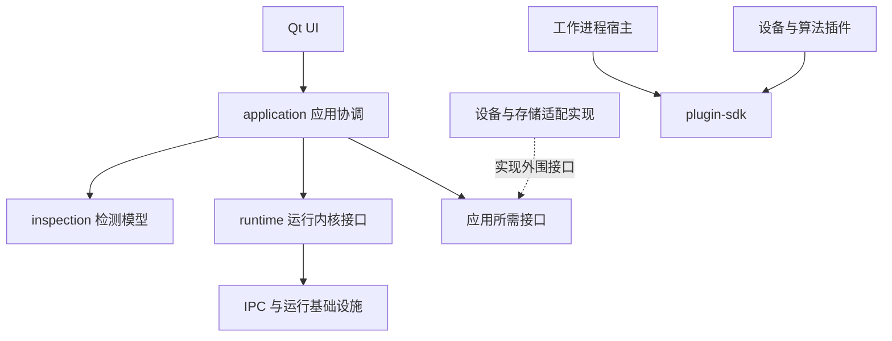
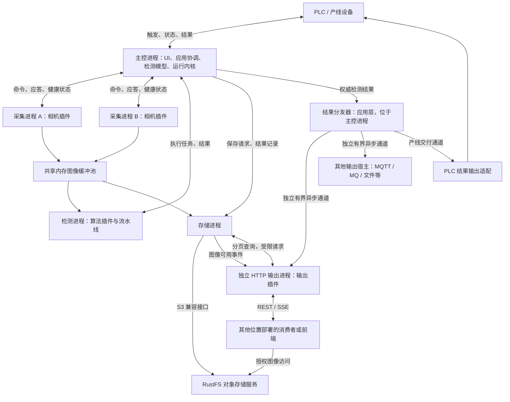

# 工业视觉检测上位机开源框架架构设计

版本：0.1（架构基线）  
日期：2026-09-15  
技术方向：C++ / Qt  
文档状态：架构基线；Windows T01～T10基础/模拟采集范围已验收，正式双相机采集与故障恢复已接通；真实设备与生产闭环尚未实现。当前详细范围按主计划0.8及ADR-004～010。

实施细化以 [开发计划及要求](开发计划及要求.md) 0.8、[Qt 边界决策](docs/decisions/ADR-001-Qt与依赖边界.md)、[模拟设计范围](docs/decisions/ADR-002-首版模拟设计范围.md)、[监护健康与调度边界](docs/decisions/ADR-007-监护健康与调度边界.md)、[共享图像与插件宿主边界](docs/decisions/ADR-008-共享图像与插件宿主边界.md) 和 [模拟采集与全量回归](docs/decisions/ADR-009-模拟采集分步接入与全量回归.md) 为准；实际进度见 [进度台账](开发进度及计划.md)。

## 1. 项目定位、目标与决策状态

本项目是一个可插拔、可回放、可诊断的工业视觉检测上位机框架。它提供设备接入、检测执行、产线交互和运行保障，让使用者通过配方、算法及设备适配搭建不同产品的检测应用。

采用“独立轻量核心，组合成熟开源组件”的路线。重点是可复用的检测闭环和稳定运行机制。首版不建设完整低代码平台、大规模内置算法库和跨机器分布式集群；首版包含常用 ONNX 深度学习推理，覆盖目标检测、图像分类和实例分割，以 YOLO 系列导出模型为主要示例，默认选择目标检测。同一台电脑上的多进程架构照常建设。

### 1.1 已确定的架构方向

- 技术栈为 C++ / Qt。
- 运行上采用主控进程与独立工作进程，隔离相机 SDK、算法和存储故障。
- 代码上采用固定基础规则与可扩展接口，设备、算法等按需插件化。
- 明确区分运行内核 `runtime`、通用检测模型 `inspection`、应用协调 `application`。
- 图像数据与控制消息分开传输；所有正式工作队列有容量上限。
- 无硬件演示、模拟设备、离线回放和诊断能力作为首版基础。
- 图像初步采用对象存储，选用独立部署的 RustFS 作为目标服务，通过 S3 兼容接口适配。
- 增加独立进程承载的 HTTP 输出插件，提供检测结果查询、实时事件与图像访问接口；外部前端可单独部署，本项目当前不建设前端。
- 结果输出统一为“检测结果契约 + 结果分发器 + 可插拔输出通道”，支持同一结果多路分发；HTTP 是其中一种通道，PLC、消息队列等按相同扩展边界接入。

### 1.2 建议默认值，实施前验证

| 项目 | 建议默认值 | 验证内容 |
|---|---|---|
| 首发平台 | Windows x64 | 真实 SDK、驱动和目标工控机兼容性 |
| 工具链 | C++20、Qt 6、CMake、固定 MSVC 工具链 | SDK 和所选依赖支持情况 |
| UI | Qt Widgets | 工业操作与图像显示需求 |
| 进程控制通道 | QLocalSocket / QLocalServer | 消息封包、断线、部署权限 |
| 图像通道 | 共享内存缓冲池 | 容量、所有权、恢复与性能 |
| 插件实现 | 同工具链 C++ 动态库接口 | ABI 兼容检查与 SDK 依赖 |
| 基础图像库 | OpenCV | 像素格式转换和实际算法需求 |
| 深度学习推理 | ONNX Runtime C++ API，CPU 为基础后端 | 三类模型的导出格式、算子兼容与结果正确性；GPU 为可选能力 |
| 追溯索引 | SQLite 保存检测元数据与对象引用 | 索引单写入所有权、查询与写入吞吐 |
| 图像存储 | RustFS 对象存储，S3 兼容客户端适配 | 固定服务/客户端版本，实测上传、下载、鉴权和签名 URL；本地文件仅作有限暂存或演示后备 |
| 网络输出 | 独立 HTTP 输出插件进程，REST + SSE | 客户端隔离、限流、查询超时和断线恢复；HTTP 库在实施时选择 |

这些是设计建议，不代表依赖已安装或完成性能验证。

### 1.3 首版不包含

- 完整可视化流程编程平台及通用脚本语言。
- 跨机器分布式调度和集群管理。
- 全品牌相机、全协议 PLC 的一次性支持。
- 任意编译器之间的 C++ 插件二进制兼容。
- 正在执行任务时热卸载插件。
- 由普通桌面操作系统承担硬实时运动或剔除控制。

## 2. 统一概念与设计边界

| 概念 | 定义 | 关键边界 |
|---|---|---|
| 运行内核 | 统一执行生命周期、调度、期限、容量和恢复机制 | 不解释瓶盖、标签等产品含义 |
| 检测模型 | 工件、检查项、结果和检测完成规则 | 不依赖 SDK、Qt 控件或进程 API |
| 应用协调 | 将检测用例转换为执行任务，并协调产线行为 | 不实现底层设备协议 |
| 进程 | 独立地址空间中的运行载体 | 控制崩溃范围，不自动保证资源独占 |
| 线程 | 进程内部执行单元 | 共享地址空间，不能隔离内存破坏 |
| 插件 | 通过统一接口扩展具体能力的代码模块 | DLL 插件本身不是故障边界 |
| 共享内存 | 供多个进程访问的数据区域 | 不自带队列、通知、所有权规则 |
| 有界队列 | 有最大容量的任务或数据交接结构 | 满载时必须有明确行为 |

“内核”是应用框架术语，不是操作系统内核。整体借鉴小核心、独立服务协作的思想，但不是实现微内核操作系统。Linux 通常归类为支持可加载模块的宏内核，内核模块不具备用户进程式的故障隔离；不能以 Linux 模块机制证明插件具备崩溃隔离。

文件夹、代码层、插件和进程是不同维度。一个进程可以承载多个代码模块，一个业务用例可以跨多个进程。不要按文件夹数量决定进程数量。

## 3. 总体架构：三个视角

### 3.1 系统职责

- 上位机：接收触发、组织采集检测、关联结果、回传状态、追溯与诊断。
- 相机与采集硬件：曝光、采集、硬件时间戳及硬件触发能力。
- PLC：产线握手、工件跟踪及约定的现场控制；精确剔除时序通常在此完成。
- 操作员：启动停止、选择配方、处理报警、查看追溯。

软件保持响应不等于产线可以继续生产。关键检测缺失时，必须按约定撤销就绪、暂停工位或处理未检测工件。

### 3.2 代码依赖



`runtime` 和 `inspection` 不互相依赖，由 `application` 连接。领域代码不依赖基础设施实现；接口放在使用方模块或独立小型契约库中。禁止把所有头文件集中为一个无边界的公共库。

### 3.3 运行部署



图中箭头表示逻辑流向，实际图像访问必须先取得有效缓冲租约。主控可消费受限预览数据，但不承担全量图像搬运。

## 4. 进程和线程设计

### 4.1 进程职责

| 角色 | 职责 | 默认划分与限制 |
|---|---|---|
| 主控进程 | UI、工件协调、任务与设备状态、PLC 握手、工作进程监护 | 首版 UI 与主控同进程，但代码可分离 |
| 采集进程 | SDK 初始化、参数设置、采集、图像交接 | 默认每相机一个；SDK 约束可能要求按设备组划分 |
| 检测进程 | 加载算法、执行流水线、输出结构化结果 | 按流水线和资源预算划分，不为每个算子开进程 |
| 存储进程 | 图像编码、对象上传、索引记录、查询、保留清理 | 首版共享一个，限制并发、暂存与队列容量 |
| HTTP 输出进程 | 加载输出插件，提供查询、实时事件、授权图像入口 | 独立于主控和存储，慢连接或崩溃不阻塞检测 |
| 通用输出宿主 | 承载 MQTT、消息队列、文件等输出插件 | 默认每个启用输出实例独立进程；同进程合并意味着共用故障边界 |
| RustFS 服务 | 保存图像与掩码等对象 | 独立部署，可在本机或其他服务器；不是主控内嵌库 |

通信插件首版可运行在主控的通信执行单元中，但必须非阻塞、可控；若依赖不可控的厂商库，应移到独立设备进程。加载到主控的插件崩溃仍可能影响整个主控。

UI 与主控同进程意味着 UI 内存错误仍会带走主控。这是首版明确接受的限制。需要关闭界面后继续生产时，再拆为后台主控服务和 GUI 客户端。

### 4.2 进程内部线程

- UI 主线程只处理交互和显示，不执行 SDK、算法、磁盘写入或阻塞等待。
- 主控调度采用明确的事件处理线程，尽量让状态由单一执行上下文修改。
- 通信线程处理协议状态机和收发，不直接改工件内部状态。
- 采集回调尽快完成数据交接；控制调用遵循厂商的线程亲和性要求。
- 算法使用受限线程池；按线程安全性、CPU/GPU 和显存确定并发。
- 存储使用少量工作线程，限制磁盘并发。

不按类分配线程，不跨模块持锁执行 SDK 调用或耗时操作。Qt 信号槽适合通知和控制，但排队连接不自动提供业务容量限制。高频任务走显式有界队列，并控制通知数量。

### 4.3 隔离能力边界

独立线程可避免普通阻塞直接占住 UI，但不能隔离 SDK 内存越界。独立进程可以隔离多数进程内崩溃，也能终止卡死的 SDK 宿主；仍可能受到系统内存耗尽、CPU 饱和、磁盘占满、GPU/驱动故障等共同影响。容量预算、并发限制和健康监测不可省略。

## 5. 运行内核：职责严格收敛

### 5.1 保留的职责

1. 工作进程生命周期：启动、初始化、就绪、停止、退出。
2. 通用执行任务：接纳、派发、在途管理、完成和取消。
3. 截止时间与健康：进程存活、任务进展、超时事件。
4. 流量与资源约束：队列容量、最大在途任务数、资源占用记账。
5. 恢复机制：按上层选定策略终止、重建、限制重试、报告恢复状态。

运行内核可以执行有限且明确的恢复策略，但不推断产品是否 NG，也不自行决定剔除哪个工件。应用协调根据依赖关系确定业务影响范围，运行内核实施对应动作。

### 5.2 不进入内核的内容

相机品牌逻辑、算法、产品阈值、PLC 地址表、数据库 SQL、图像编码、ROI 界面、配方编辑和产品专用规则均属于外围。

共享内存与 IPC 的具体实现属于运行基础设施；内核通过接口控制容量与生命周期。不是所有基础工具都要成为内核的一部分，更不是都要做成插件。

### 5.3 状态与不变量

建议通用执行任务状态为：排队、执行中、完成、失败、取消、超时。进程状态与任务状态分别管理。

- 一个执行任务只产生一个权威终态；迟到消息不能复活任务。
- 超时是逻辑终态，不代表后台执行已经停止。
- 执行资源和缓冲区要等使用者停止访问后才能回收。
- 内核不持有无界队列，不无限重启，不静默吞掉错误。
- 失败事件保留原因、任务身份和运行代次，供应用协调处理。

## 6. 检测模型与应用协调

### 6.1 领域抽象的实际含义

领域模型是业务概念与规则的代码表达，不是额外写一段业务说明，也不要求复杂的 DDD 框架。简单流程可由结构体与集中函数实现，复杂后再提取对象。

换相机主要由设备接口解决，不是领域模型的独有价值。领域模型解决收到数据后如何理解它：属于哪个工件、是什么检查项、是否有效、何时完成、如何判定。

产品原型描述用户看到和操作的内容，也可以包含业务规则；领域模型让这些规则在 GUI、PLC 和回放入口下保持一致。去掉界面后依然成立的检测含义，是模型的核心。

### 6.2 通用概念

| 概念 | 内容 |
|---|---|
| Workpiece | 被检测工件的身份；真实关联来自触发、扫码或 PLC 跟踪约定 |
| Inspection | 对一个工件执行的一组检查及其状态 |
| Check | 检查项身份、所需输入、输出与完成要求 |
| CaptureRequirement | 相机、帧数、采集序列等输入要求 |
| RecipeSnapshot | 当前检测固定使用的参数、模型、标定版本 |
| CheckResult | 检查项输出、测量值、质量判定及关联信息 |

执行状态与质量判定分别表达。超时、算法失败、缺图不等于“检测完成且 NG”。未完成工件如何处置由产线策略决定，追溯仍保留原始执行状态。

### 6.3 贯穿示例：双相机检查瓶子

配方定义相机 A 检查瓶盖、相机 B 检查标签。通用模型只认识检查项 ID 和规则，不在源码中写死瓶盖、标签。

1. PLC 触发经过协议映射，关联工件 1001。
2. 应用协调创建检测实例，固定配方版本，创建采集和算法执行任务。
3. 结果到达时校验工件、检查项、运行代次及是否重复。
4. 默认策略要求全部必需检查项完成，再给出最终质量判定；全部 OK 才为 OK，否则为 NG。
5. 任一检查项未完成且超过期限，记录未完成原因，不伪造普通 NG。
6. 1002 的结果不能补到 1001；已结束任务的迟到结果只能记录诊断信息。

首版采用固定流水线和明确汇总策略，不把流程编辑器自带的数据传播直接当作生产调度器。

### 6.4 应用协调的作用

`InspectionCoordinator` 将检测需求转换成运行任务，将执行事件转换成检查状态，再请求 PLC 回传、存储和 UI 通知。它组织用例，不重写 SDK、协议、判定算法或数据库逻辑。

`ProductionController` 管理生产就绪条件、启停与配方切换。完整配方文件由配置服务管理；每次检测绑定不可变快照。切换时停止接纳或等在途任务结束，应用配置并验证，失败则回退；部分设备无法可靠回退时保持未就绪，不能假定切换成功。

## 7. 通信、共享内存与有界队列

### 7.1 两类通道

| 通道 | 默认实现 | 内容 |
|---|---|---|
| 控制与元数据 | 本地套接字 | 命令、应答、任务、结果、状态、心跳、图像描述 |
| 大图像数据 | 共享内存缓冲池 | 像素缓冲，必要的图像处理结果 |
| 进程内交接 | 有界队列 | 待执行任务和有效图像引用 |

共享内存是数据区域，队列是组织结构。首版不实现复杂的跨进程无锁队列：通过本地套接字传描述，接收方入有界队列。套接字发送积压同样需要限额，不能将无界积压转移到系统缓冲中。

控制协议使用显式消息长度、协议版本、类型、请求 ID、运行代次和关联 ID。验证长度上限、枚举和字段；不假定一次读取等于一个消息。不将 C++ 对象、原始指针或 STL 容器直接作为跨进程协议。

### 7.2 图像描述与所有权

图像描述至少包含：相机 ID、帧号、触发关联、运行代次、缓冲池 ID、槽位与代次、偏移与长度、宽高、步长、像素格式、时间戳及其来源。

SDK 缓冲可能在回调返回后被复用。首版允许复制一次到自有共享内存；只有 SDK 明确支持保留缓冲时才使用对应机制。不要提前追求全链路零拷贝。

建议槽位生命周期为：空闲 → 写入中 → 已发布 → 消费完成 → 空闲。发布后像素只读，多消费者通过显式租约记账，不仅依赖崩溃后可能无法递减的共享计数器。

- 宿主管理槽位，发布前确认消费者与容量。
- 释放消息包含槽位代次，重复释放不重复回收。
- 使用者崩溃后确认其退出，撤销对应租约。
- 工作进程重建时使用新运行代次，拒绝旧引用。
- 主控失联后停止接收新工作并按关闭协议退出；新主控不能在旧使用者尚存时复用旧池。

具体池实现需在开发时细化并测试上述协议。禁止把逻辑任务超时直接等同于可以覆盖图像。

### 7.3 队列策略与容量预算

| 用途 | 满载策略 |
|---|---|
| 实时预览 | 覆盖旧预览，仅保留最新数据 |
| 正式检测 | 拒绝新任务、撤销就绪或请求暂停；记录过载，不静默丢弃 |
| 可选存图 | 按配方跳过并记录原因，避免长期占用检测缓冲 |
| 强制追溯 | 保证接纳条件，不满足时暂停生产或报告明确故障 |
| PLC 结果发送 | 有界待确认队列，按协议去重和处理超时 |
| HTTP 输出事件 | 独立有界队列；可断开慢消费者并提示补查，不反向阻塞检测 |

强制追溯应在接纳任务时考虑存储容量。存储可使用独立受限缓冲或复制策略，防止慢消费者拖住整个采集池；分进程不自动解决这种逻辑耦合。

内存预算包含帧步长乘高度、缓冲数、相机数、算法中间结果、预览和存储缓存。2448 × 2048 Mono8 约 5 MB，四相机各积压 20 帧约 400 MB，尚未含其他内存。

## 8. 稳定性、异常与恢复

### 8.1 健康判断

分别监测存活、就绪、进展和期限。无触发时没有图像不等于故障；有任务却长期无进展才需要处理。截止时间使用单调时钟；日志时间与相机硬件时间戳分开，不默认多设备时钟已同步。

### 8.2 故障处置

| 故障 | 运行机制 | 应用处置 |
|---|---|---|
| 相机断线 / SDK 崩溃 | 停止派发，按策略重建采集进程 | 将受影响检查记为未完成，撤销相关工位就绪 |
| 算法超时 | 协作取消；超过停止宽限期可终止进程 | 处理该进程所有受影响在途任务，拒绝迟到结果 |
| 存储满 / 写失败 | 报告故障与容量，控制积压 | 按可选或强制追溯策略处理 |
| RustFS 不可达 / 上传卡住 | 请求超时、有限重试、受限本地暂存 | 明确图像待上传或失败；按追溯策略处理，不无限持有检测缓冲 |
| HTTP 输出卡死 / 崩溃 / 客户端慢 | 主控停止向其排队，独立重启；客户端超时或断连 | 不改变检测质量判定，不撤销生产就绪，仅报告输出降级 |
| PLC 断线 | 重连，停止产生无界待发送消息 | 撤销就绪，暂停新产线任务 |
| 主控退出 | 工作进程检测失联并停止 | PLC 按上位机心跳超时约定执行现场策略 |

“互不影响”是限制故障范围，不是所有工位无条件继续。共享一个检测进程的任务会共同受到该进程重启影响。

### 8.3 恢复顺序

隔离故障 → 停止接纳相关任务 → 标记受影响检测 → 取消或终止执行 → 确认退出并回收资源 → 退避重启 → 初始化与配置 → 验证就绪 → 同步产线状态 → 恢复接纳。

区分可恢复故障与配置错误。限制重启次数和频率，超过阈值进入需人工处理状态。禁止强杀线程作为通用恢复手段。

### 8.4 重复、重试与物理动作

算法重算和物理动作重发不同。PLC 剔除、运动或设备触发需要请求 ID、应答、去重及恢复约定。未收到应答不能证明动作未执行，不承诺仅凭本地消息机制实现物理动作“恰好一次”。

主控重启后默认不自动恢复生产，不重放旧控制命令；先与 PLC 协调旧在途工件的处置，再建立新运行代次。

### 8.5 正常停止

撤销就绪 → 停止接受新触发 → 按策略完成或取消在途任务 → 停采集 → 处理必要存储与应答 → 释放插件和共享资源 → 退出工作进程。每个等待均有上限。

## 9. 插件架构与开发契约

### 9.1 扩展范围

| 插件 | 职责 | 宿主 |
|---|---|---|
| 相机 | 枚举、连接、能力查询、参数、采集 | 采集进程 |
| 算法 | 初始化、参数与模型、执行、结构化结果 | 检测进程 |
| 通信 | 协议编解码、读写、连接状态 | 受控通信单元或独立设备进程 |
| 光源 / IO | 通道、亮度、输入输出和状态 | 后续设备宿主 |
| 对象存储 | 通过 S3 兼容客户端上传、访问和删除图像对象 | 存储进程；首个目标为 RustFS |
| HTTP 输出 | 结果查询、实时事件、授权图像访问 | 独立 HTTP 输出进程，禁止加载进主控 |
| 其他结果输出 | MQTT、消息队列、Webhook、文件、PLC 结果映射等 | 输出宿主；具体职责和交付等级见 12.8 节 |

不同设备类别独立接口，共享基础状态和参数描述，不设计万能设备接口。先有稳定接口，再按分发需要做动态插件，不要求所有模块插件化。

### 9.2 插件声明

插件提供 ID、版本、接口版本、构建平台、Qt/编译器兼容信息、SDK 依赖、能力、参数模式、实例数量限制和线程安全声明。参数模式包含类型、单位、范围、枚举、读写与运行中可修改条件，供 UI 自动生成面板。

宿主管理调度与资源；适配器封装 SDK 自带线程。插件不得直接改主界面、操作内核私有状态或绕开协调器回传生产结果。生命周期明确为创建、初始化、就绪、执行、停止、销毁，停止可能失败，宿主需有进程级兜底。

### 9.3 二进制和发布边界

首版固定工具链，拒绝不兼容插件；不假定 C++ ABI 跨编译器稳定。跨动态库对象的创建与销毁归属必须一致。跨进程使用序列化契约，不传 C++ 对象内存布局。

仅在停机、无在途调用和无剩余 SDK 线程时卸载插件；首版可优先通过重启宿主切换版本。厂商 SDK 可选安装，缺失时给出明确诊断，不影响模拟演示构建。

## 10. 四条架构思维的项目体现

| 思维 | 回答的问题 | 项目实例 | 常见误区 |
|---|---|---|---|
| 文件组织 | 到哪里找代码？ | 相机适配在 plugins/cameras，进程监护在 runtime | 文件夹分开就认为已解耦 |
| 层次分离 | 谁能依赖谁？ | UI 调用应用用例，存储实现应用定义的接口 | 把全系统套成 UI/Service/Repo |
| 职责分离 | 一次变更应影响哪里？ | SDK、缓冲、调度、判定、存储各有负责人 | 每个函数一个类、每个类一个线程 |
| 领域抽象 | 数据代表什么，什么行为有效？ | 工件、检查项、完成条件、质量判定 | 只改类名，规则仍散落在回调中 |

### 10.1 文件组织

新增大恒相机修改相机插件目录；更改超时执行机制修改 runtime；修改汇总判定修改 inspection 的策略；调整页面修改 ui。代码审查不仅看目录，也检查跨模块依赖。

### 10.2 层次分离

历史查询可以用 UI → 查询服务 → 仓库接口 → SQLite 实现。采集调度是事件与任务系统，不应为套用三层而虚构数据库仓库。代码层与部署进程分别设计。

### 10.3 职责分离

相机适配器集中封装 SDK，缓冲池管理像素生命周期，运行内核管理执行，检测模型维护检测规则，应用协调组织流程。单一职责是围绕同一变化原因聚合，不是禁止一个类有多个方法。

### 10.4 领域抽象

双相机结果不能用“收到两个 bool”表示完成，必须核对工件及检查项。规则通过集中操作执行，页面和 PLC 模块消费权威结果。简单流程可用普通函数与结构体，不额外构建复杂框架。

设备替换由适配接口解决；领域模型使业务含义不散落在技术回调中。两者相互配合，不能互相冒充。

## 11. 建议目录与代码示意

```text
架构设计.md
CMakeLists.txt
cmake/                         构建和依赖配置
src/
  contracts/                   小型公共 ID、错误和消息契约
  runtime/                     通用执行内核
    scheduling/
    lifecycle/
    supervision/
    recovery/
  inspection/                  工件检测模型与通用判定策略
  application/                 检测与生产用例、外围接口
    result-output/             结果契约、分发、路由和交付状态
  ipc/                         消息编解码、共享内存与缓冲租约
  plugin-sdk/                  插件声明、接口、参数模式
  worker-host/                 插件加载和工作进程公共逻辑
  infrastructure/              配置、存储和协议适配实现
  ui/                          Qt 控件、页面、视图模型
apps/
  workstation/                 主控程序入口与依赖装配
  capture-worker/              采集进程入口
  inspection-worker/           检测进程入口
  storage-worker/              存储进程入口
  output-worker/               通用输出宿主入口，按实例配置加载插件
plugins/
  cameras/                     模拟相机与厂商适配
  algorithms/                  示例算法和推理后端
    onnx/                      ONNX 推理插件
      inference/               会话、输入输出张量、执行后端
      preprocessing/           缩放、填充、归一化、布局转换
      adapters/                按模型导出契约解析输出
      postprocessing/          检测框、分类与实例掩码处理
  communication/               PLC 与其他协议
  storage/
    s3/                        面向 RustFS 的对象存储适配
  outputs/
    http/                      REST、SSE、鉴权与读模型转换
    mqtt/                      物联网主题发布（后续）
    message-queue/             RabbitMQ、Kafka 等独立适配（后续）
    webhook/                   向外部 HTTP 接口推送（后续）
    plc/                       结果映射与交付，复用通信契约
    file/                      JSONL、CSV 导出
    tcp/                       项目自定义网络协议（按需）
examples/                      演示图像、配方、完整示例
tests/                         模型、协议、故障注入和闭环测试
docs/                          接口、插件开发和部署文档
```

目录是边界建议，实施时不必预建全部空模块。避免新增一个无所不包的 `Manager` 或 `utils`。

### 11.1 检测模型示意

以下仅表达接口与责任，不是完整可编译实现。身份类型、存储结构和错误类型在实施时定义。

```cpp
enum class Verdict { Unknown, OK, NG };
enum class CheckState { Pending, Running, Completed, Failed, TimedOut };

struct CheckResult {
    WorkpieceId workpiece;
    CheckId check;
    Verdict verdict;
};

class Inspection {
public:
    Inspection(WorkpieceId id, RecipeSnapshot recipe);

    AcceptStatus accept(const CheckResult& result);
    void markTimedOut(CheckId check);
    void markFailed(CheckId check, FailureReason reason);

    bool isFinished() const;       // 生命周期是否终结
    bool allChecksCompleted() const;
    Verdict verdict() const;
};
```

`accept` 维护结果归属、检查项合法性、去重和终态规则，不调用 Qt、SDK 或数据库。运行代次和执行任务 ID 在应用入口先校验并映射到检测身份，不能仅凭工件编号接收旧会话消息。

### 11.2 应用协调示意

```cpp
void InspectionCoordinator::onExecutionResult(const ExecutionResult& event) {
    // 验证运行代次、执行任务身份和消息有效性。
    // 将执行输出映射为工件检查结果。
    // 调用 Inspection::accept，拒绝重复和过期结果。
    // 检测首次进入终态时，安排回传、追溯和 UI 通知。
}
```

运行内核提供派发、取消和执行事件，应用协调提供业务关联，检测模型提供权威业务状态。此示意不表示每次事件都应立即发送 PLC 物理命令。

## 12. 通用功能路线

| 功能 | 首版 | 后续 |
|---|---|---|
| 相机接入 | 模拟相机 + 一个实测品牌；能力与参数接口 | 更多 SDK、GenTL 适配 |
| 检测执行 | 固定流水线、完整任务身份、ONNX 目标检测/分类/实例分割 | 多流水线与更复杂编排 |
| 模型配置 | 任务类型选择，默认目标检测；模型、标签、输入与后处理配置 | 更多模型适配器和 GPU 后端优化 |
| 图像查看 | 缩放平移、像素查看、基本 ROI、标注层 | 更丰富 ROI、标定坐标、对比工具 |
| 参数面板 | 参数模式驱动基础控件 | 插件自定义面板 |
| PLC | 一种协议、模拟端、明确握手 | 更多协议与设备 |
| 配方 | 快照、校验、导入导出、切换失败处理 | 差异查看、迁移工具 |
| 追溯 | 结果索引、RustFS 对象图像、受限上传暂存与保留策略 | 报告与更复杂归档 |
| HTTP 后端输出 | 独立插件进程；结果查询、SSE 实时通知、图像访问 | 按真实集成需求扩展接口；外部前端不在当前范围 |
| 通用结果输出 | 统一结果、分发与交付状态；HTTP、PLC 和基础文件示例 | MQTT 优先，其余 MQ、Webhook、TCP 按项目需求接入 |
| 离线回放 | 图片目录、单步与循环、同一执行路径 | 事件录制、版本回归比较 |
| 诊断 | 日志、任务耗时、队列深度、版本和错误 | 诊断包、趋势与更完整性能分析 |
| 光源 / IO | 预留类别接口，按首个项目需求接入 | 更多设备适配 |
| 权限 | 明确操作与工程配置入口 | 用户角色、审计 |
| 无界面执行 | 核心不依赖 GUI，模拟测试入口 | 面向用户的完整 CLI/后台服务 |

调试和回放默认不接真实生产输出。原图、算法数据和绘制标注分开，不能把画框后的图像误作原始检测输入。

### 12.1 常用深度学习推理：ONNX 模型

首版正式功能范围包含以下三类任务，不仅预留接口。优先完成目标检测，再补齐分类和实例分割。使用者提供已经导出的 `.onnx` 模型，上位机负责加载和推理；模型训练与导出不属于首版功能。

| 可选任务类型 | 典型用途 | 统一输出 | 显示方式 |
|---|---|---|---|
| 目标检测（默认） | 缺陷定位、零件计数、缺件检查 | 类别、置信度、原图坐标检测框 | 框、类别和置信度 |
| 图像分类 | 产品类别、表面状态、整体合格性识别 | 类别分数、Top-K 结果 | 类别与分数 |
| 实例分割 | 独立缺陷区域、对象轮廓 | 每个实例的类别、置信度、框和掩码 | 半透明掩码、轮廓与框 |

“YOLO”表示模型适配示例，不意味着任意 YOLO 版本或任意 ONNX 文件都可直接兼容。不同任务、版本和导出选项的张量格式可能不同。首版为三类任务各固定一个经验证的导出契约及样例模型，维护兼容清单；具体模型版本在实施时选定。加载不匹配模型时明确报错，不能仅依赖用户选择的类型强行解释输出。

### 12.2 推理运行位置与处理流程

ONNX 插件运行在检测进程内，复用算法插件接口。运行内核只管理任务、资源与超时，不包含模型预处理、张量解析或 NMS。

处理流程：有效图像引用 → 按模型契约预处理 → ONNX Runtime 执行 → 对应适配器解析输出 → 后处理与坐标还原 → 结构化算法结果 → 应用协调提交检查结果。

- 模型会话初始化时创建并预热，重复用于后续任务，不逐帧重新加载模型。
- 预处理明确 RGB/BGR、灰度转换、输入尺寸、缩放或 letterbox、归一化、数据类型和 NCHW/NHWC；不能对所有任务使用同一套默认处理。
- 检测框按导出格式解析；明确模型是否已包含 NMS，避免重复处理。置信度和 IoU 阈值按适配器能力提供。
- 分类明确输出是 logits 还是概率，以及单标签或多标签语义；不无条件执行 softmax。首版基础样例采用单标签 Top-K。
- 实例分割按模型契约解码掩码，撤销填充并映射到原图或 ROI 坐标，限制掩码数量与内存占用。
- ROI 推理结果还原到原图坐标；显示缩放不改变算法输出坐标。
- 无目标、低置信度与模型运行失败分别表达。无目标不自动等于 OK 或 NG，由检查配置决定。
- 大型掩码走受控图像/结果缓冲通道，不把全尺寸掩码数组无限塞入控制消息。

首版以 CPU 后端保证无 GPU 可用，CUDA 等加速后端按需构建与验证。配方明确后端与回退策略；GPU 不可用时不得无提示切到可能不满足节拍的 CPU。限制会话数量、Runtime 内部线程数及同时推理任务数，避免线程池叠加造成过度并发。

### 12.3 配方与界面

模型配置页提供任务类型下拉框：目标检测、图像分类、实例分割，默认选择目标检测。切换类型时同步显示适用参数，并重新校验模型适配契约。

配方记录模型路径与内容哈希、任务类型、适配器版本、标签映射、输入规格、预处理、阈值、后处理、执行后端以及 ROI。支持“加载校验”和“样例试运行”，显示输入输出信息、预览结果与耗时。

模型文件和相关配置绑定配方快照，切换遵循既有停机或排空在途任务策略。追溯保存模型身份及有效配置，便于同图回放。算法输出类别和几何信息；具体类别是否算缺陷、数量是否达标由检查规则配置，不写进通用推理引擎。

### 12.4 深度学习验收

- 三种任务各有一个明确授权来源的 ONNX 样例和固定测试图，无工业相机也能运行。
- 与模型原始推理实现或可靠参考结果比较，按预先设定容差验证类别、分数、框与掩码还原。
- 覆盖无目标、非方形图像、ROI、错误模型类型、缺失标签和不支持算子等输入。
- 验证模型切换、任务超时和检测进程重启后无旧结果混入。
- 测量预处理、推理、后处理和端到端耗时，以及持续运行的内存占用；不只报告模型执行时间。
- 样例模型权重、导出工具和推理依赖的许可证分别核对，模型不能因采用 ONNX 格式就被视为可自由再分发。

### 12.5 RustFS 对象存储

图像存储初步选用 RustFS，框架通过 S3 兼容接口访问，不依赖其服务内部实现。RustFS 是独立服务，可与工控机分开部署；存储插件运行在存储进程中。实施时固定并验证 RustFS 与客户端版本，不假定支持所有 S3 扩展能力。

检测元数据与图像对象分开管理：SQLite 首版保存工件、检查结果、配方与模型版本，以及对象键、大小、校验值和上传状态；图像、掩码等二进制内容进入对象存储。数据库由存储服务统一负责，HTTP 插件通过受限查询接口读取，不直接争用数据库写锁。

建议对象键包含产线/工位、日期、运行代次、检测 ID 和图像 ID，不只使用可重复的工件编号或时间戳。模型和配置沿用快照身份，临时签名 URL 不作为永久图像标识保存。

上传流程：接收保存任务 → 复制或编码到受限存储缓冲/暂存文件 → 及时归还检测图像租约 → 记录待上传状态 → 上传对象 → 验证响应 → 更新可用状态 → 发布图像可用事件。数据库与对象存储没有天然跨系统事务，必须通过 pending/available/failed 状态、幂等对象键和启动对账处理部分成功。

本地暂存有字节数、任务数和保留时间上限。请求设置连接与操作超时，有限重试并退避；重启后根据持久暂存与状态对账，不盲目重复建对象。删除与保留清理由存储服务统一管理，同步更新索引，不把已删除图片伪装成可用。

RustFS 不可达时，主控仍可响应，其他进程不因网络调用阻塞；是否暂停接纳生产任务取决于配方的强制追溯要求。这是明确的业务策略，不是进程被拖死。HTTP 展示输出则始终是非关键消费者，其故障不要求生产停机。

### 12.6 独立 HTTP 输出插件：仅后端接口

用途是让其他位置部署的前端或系统通过网络读取检测结果及图像。首版不开发网页、不提供远程设备控制，不把外部客户端作为检测闭环的完成条件。HTTP 进程由主控监护，运行插件；插件不调用相机 SDK、算法执行或 PLC 控制接口。

建议首版接口契约：

| 接口 | 内容 |
|---|---|
| `GET /api/v1/health` | 输出服务存活、数据更新时间与依赖降级状态，不冒充生产就绪 |
| `GET /api/v1/inspections` | 按工位、时间、判定等过滤，游标分页且限制页大小 |
| `GET /api/v1/inspections/{id}` | 检测详情、执行状态、质量判定、检查项和图像上传状态 |
| `GET /api/v1/events` | SSE 推送新结果及图像可用事件，适合单向实时输出 |
| `GET /api/v1/images/{id}/access` | 经权限检查返回短期图像访问地址，或受限代理地址 |

结果事件包含事件 ID、检测 ID、工件 ID、工位、运行代次、时间、执行状态、质量判定和图像状态。推理结果可先通知，图像上传完成后再通知；事件明确持久化状态，避免将实时收到等同于已可靠入库。分数、框等结构化摘要可随事件输出，大图和掩码不放进 SSE。

首版实时采用 SSE，无需为单向输出先增加双向 WebSocket。实时表示尽快异步通知，不承诺硬实时或逐客户端可靠送达。客户端按事件 ID 去重，断线后通过受限重放窗口恢复；超出窗口明确要求重新查询。历史查询只能补回已经持久化的数据，不能承诺恢复尚未落库就丢失的事件。

每个客户端连接、发送缓冲、请求并发、查询时长和消息大小均有上限。慢客户端断开或收到缺口提示；上游到 HTTP 进程的发送同样非阻塞且有界，溢出标记为数据缺口并安排重同步。主控不等待网络客户端应答，也不让 HTTP 进程持有正式检测图像缓冲。外部查询使用低优先级并发配额，不能耗尽存储写入所需资源。

部署时配置绑定地址、接口鉴权和 TLS 终止方式。浏览器跨域只允许配置的来源；不将 RustFS 管理凭据发给客户端。优先由 HTTP 服务授权后提供短期对象 URL；客户端无法直达 RustFS 时，可用受限流式代理，不整图无限缓存。URL 必须使用客户端可访问地址，前端页面实现仍属于外部项目。

### 12.7 对象存储与 HTTP 输出验收

- RustFS 断网、拒绝请求、慢响应、暂存满时，检测与主控无同步网络等待，资源占用不超过预算。
- HTTP 进程被终止、永久阻塞或连接大量慢客户端时，采集、检测及 PLC 闭环保持正常；只记录输出降级。
- 核对上传成功但索引更新失败、上传未完成就重启等场景，恢复后对象与索引能对账。
- SSE 重复、缺口、重连及图像稍后可用均可通过接口正确表达，不混入旧运行代次数据。
- 查询洪峰不耗尽存储写入资源；图像 URL 过期和无权访问有明确响应。
- 使用接口测试客户端和命令行验证即可，不以建设前端页面作为验收前提。

### 12.8 通用结果分发与输出插件

#### 职责边界

检测模型产生只读的权威检测结果，不调用输出插件。应用协调提交结果给 `ResultDispatcher`，分发器按启用实例和路由配置进行非阻塞多路投递。插件负责协议与格式转换，不能修改质量判定。结果路由与交付状态属于应用层，运行内核只提供宿主管理、期限和容量机制。

同一个结果可以同时提供给 HTTP 客户端、物联网平台、消息中间件和 PLC。检测完成与输出交付完成是两个状态；每个通道分别记录，不用一个“已发送”布尔值代表所有消费者。

#### 常用输出模式与范围

| 输出类型 | 作用与典型场景 | 注意事项 | 建设顺序 |
|---|---|---|---|
| HTTP 服务 | REST 查询与 SSE 实时订阅，远程看板或其他业务系统访问 | 本项目提供后端；连接成功不等于客户端已处理结果 | 首版 |
| PLC 结果输出 | 写入检测结果、编号、测量值并完成产线应答 | 与工件跟踪对应，过期结果不可补发成当前动作 | 首版，选一种协议 |
| 文件输出 | JSONL/CSV，调试、数据交换和离线分析 | 字段版本、滚动文件、磁盘限额；不替代权威追溯存储 | 首版基础示例 |
| MQTT | 按产线/工位主题发布到物联网平台和监控系统 | 明确 QoS、保留消息与会话策略；协议确认不等于业务处理成功 | 首版之后优先 |
| 消息队列 / 事件流 | RabbitMQ、Kafka 等，供多个业务服务异步消费 | 每种中间件独立适配；持久化、顺序、确认和保留机制不能混为一谈 | 按实际集成需要 |
| HTTP Webhook | 主动 POST 结果到 MES 或第三方接口 | 与“提供 HTTP 服务”不同；设置幂等键、超时和有限重试 | 按需 |
| 自定义 TCP | 对接现有上位系统或专用设备协议 | 自行定义帧边界、版本、应答、去重和断线恢复 | 按需 |
| 外部数据库 | 写入客户系统的结果表或集成库 | 通过受控适配交付，不让远程数据库拖住检测 | 按需 |

以上列出扩展路线，不表示首版同时实现全部中间件。OPC UA、Modbus 等属于 PLC/工业通信协议选择，不为每种协议复制工件判定逻辑。WebSocket 可在确有双向需求时作为 HTTP 通道扩展，当前单向结果通知使用 SSE。

RustFS 仍属于图像持久化设施；结果输出携带对象身份或授权访问入口，不向每个通道重复上传整张图。核心追溯记录仍由存储服务负责，不能只依赖一个尽力交付的文件或消息输出插件。

#### 统一结果与插件接口

结果信封建议包含：模式版本、事件 ID、检测 ID、工件 ID、运行代次、产线/工位、时间、执行状态、质量判定、检查项、测量值及单位、配方/模型版本、图像对象引用和可用状态。完成结果保持不变；图像稍后可用等变化发布单独关联事件。

每个输出实例配置插件类型、实例 ID、目标端点、过滤条件、字段映射、交付等级、队列/暂存容量、超时、重试和认证引用。相同插件可配置多个实例，但其队列、故障和交付状态独立。

示意接口如下，不要求内核直接加载插件：

```cpp
class IResultOutput {
public:
    virtual ~IResultOutput() = default;
    virtual InitStatus initialize(const OutputConfig&) = 0;
    virtual SubmitStatus trySubmit(const ResultEnvelope&) = 0;
    virtual void requestStop() = 0;
    // 宿主通过独立事件通道接收关联事件 ID 的交付报告。
};
```

`trySubmit` 的 Accepted 仅表示输出实例接受任务，不表示外部业务完成。宿主使用显式类型区分已接纳、已持久暂存、传输确认、业务应答、失败、过期和未知；插件声明它能观察到的确认层级。不能把 MQTT 确认、HTTP 2xx 和 PLC 工件应答视为同一含义。

#### 交付策略与故障隔离

| 等级 | 适用场景 | 行为 |
|---|---|---|
| 尽力通知 | HTTP 实时展示、非关键监控 | 有界队列；满载可丢弃通知或断开慢消费者，明确缺口并允许查询已持久化记录 |
| 可靠异步 | MES 记录、需要补发的 MQ/Webhook | 独立持久 outbox、容量限额、重试和失败留存；按事件 ID 去重，不承诺自动恰好一次 |
| 产线关键 | PLC 检测结果交付 | 有截止时间和业务应答；失败由应用层撤销相关就绪或处置工件，不阻塞其他线程 |

可靠异步模式只有完成持久暂存确认后才报告可恢复；若检测先完成而暂存失败，必须记录交付未保障。主控不等待无限外部 I/O，必要的生产接纳约束由应用策略显式处理。

默认每个输出实例在独立 `output-worker` 中运行，避免一个插件崩溃带走其他插件。主控侧每实例独立有界发送通道，不能逐个同步调用插件等待完成；慢实例只影响自身。限制 CPU、内存、连接、磁盘与 outbox 占用，可靠输出也不能无限堆积。失败记录的保存和告警本身也需要限额。

配置需要顺序时，按工位或其他显式分区保持顺序；重试可能造成重复，消费者按事件 ID 幂等处理。过期产线指令禁止以普通数据补发策略重放。输出实例重启使用新会话代次，恢复可靠数据与恢复物理动作分开处理。

PLC 输出插件只处理结果映射和交付，触发输入仍由通信服务接收。同一 PLC 连接必须有唯一所有者；输出插件通过协议服务契约复用连接，或与通信适配一起放入一个设备宿主，不能由两方无协调地读写同一会话。共用设备宿主时承认故障边界共享。

#### 输出体系验收

- 同一个结果同时送到 HTTP、文件和模拟 PLC，内容与身份一致，交付状态分别可查。
- 一个输出实例卡死、崩溃、队列满或无限重试时，其他实例和检测闭环不被同步阻塞。
- 校验过滤、重复事件、乱序、重启和过期事件；插件不修改权威检测结果。
- MQTT/MQ 等新增插件通过同一契约测试，不要求修改检测模型或算法插件。
- 验证关键 PLC 交付失败触发明确业务策略，普通看板输出失败仅降级。

## 13. 开源开发、依赖与发布

- 无商业 SDK、无相机、无 GPU 时，仍能构建和运行模拟闭环。
- 提供最小相机和算法插件模板，说明线程、内存和生命周期契约。
- 使用可选构建项管理厂商 SDK 与推理后端，核心不强依赖全部厂商库。
- 固定发布工具链与插件接口版本，维护配置模式迁移规则。
- 发布兼容清单：相机型号、SDK、驱动、系统、编译器及验证范围。
- CI 覆盖无硬件构建与模拟故障；硬件测试单独记录，不能用模拟通过替代真实验证。
- 提供演示配方、图像和问题复现格式：运行版本、配置、关联日志、样例数据。
- 自有代码可考虑 Apache-2.0 或 MIT，最终许可证尚需选择；第三方依赖和插件分别遵守其许可证。
- 厂商 SDK 是否允许再分发逐项核实，默认由使用者安装。不能将参考项目代码直接复制后统一改成其他许可证。

## 14. 实施顺序与验收

### 阶段 A：模拟多进程闭环

构建主控、模拟采集、简单检测、存储工作进程，建立任务身份、控制协议、共享内存租约、有界队列和基础 UI。

验收：无硬件可运行；结果不串工件；队列和图像内存有上限；可追踪每个任务；杀死或卡住采集/检测进程后主控仍能响应并报告正确状态。

### 阶段 B：ONNX 常用任务、一个真实设备与一条产线协议

在模拟闭环上先接入 ONNX Runtime，按目标检测、分类、实例分割的顺序完成三类任务与模型配置页，并满足第 12.4 节验收要求。随后接入首个相机 SDK 和 PLC 协议，验证设备线程要求、真实触发关联、配方参数、握手与重连。三类推理均属于首版发布范围。

验收：拔线、重连、重复消息、PLC 失联和停止过程中故障均有明确结果；不重放旧物理命令；真实图像格式与生命周期正确。

### 阶段 C：多相机与稳定性

实现双相机工件汇总，验证过载、存储慢、磁盘满、进程重启及旧消息处理，测量延迟分布、吞吐和内存峰值。

首版发布前建立统一结果契约和分发器，接入 HTTP、PLC 结果及基础文件输出实例；接入 RustFS 存储适配。HTTP 提供 REST 与 SSE，按第 12.7 和 12.8 节验证断网、卡死、多通道隔离、慢消费者和上传对账。不开发外部前端。MQTT 作为后续优先扩展，其他消息中间件按需求选择。

验收：达到约定相机数量和节拍；在约定长稳时长内无持续资源增长；过载可观察、故障可恢复。数值由目标硬件和生产要求确定，不能预先承诺任意规模。

### 阶段 D：开源可用性

完善插件模板、文档、演示发布包和兼容清单，再决定流程编辑器、标定和更多设备的优先级。

### 必测的不变量

- 重复与乱序消息不导致重复完成或跨工件关联。
- 逻辑超时后旧执行不能覆盖新缓冲或产生有效的新结果。
- 进程崩溃后资源最终释放，回收前确认使用者已结束。
- 存储慢不会形成无界积压。
- 配方切换不会让同一个工件混用不同版本。
- 主控重启后不会自动发送旧控制动作。

## 15. 参考项目与后续决策

### 15.1 参考项目

以下基于会话中的公开 README、GitHub 元数据和部分插件目录调研，未进行源码级审计或实机验证。仓库有近期推送不能证明工业稳定性。

| 项目 | 借鉴点 | 限制 |
|---|---|---|
| [itom](https://github.com/itom-project/itom) | C++/Qt 设备与算法扩展、参数与数据模型 | 平台依赖及 LGPL/SDK 例外条款需单独评估 |
| [itom plugins](https://github.com/itom-project/plugins) | GenICam、厂商 SDK、模拟及文件采集插件 | 各插件和依赖许可证不同 |
| [Aravis](https://github.com/AravisProject/aravis) | GenICam 相机采集、GigE/USB3、相机模拟 | GLib/GObject 体系，不是直接的 Qt 模块；LGPL |
| [rc_genicam_api](https://github.com/roboception/rc_genicam_api) | C++ GenTL `.cti` 接入、参数与命令行诊断 | 厂商与设备兼容性、捆绑组件条款需逐项验证 |
| [QtNodes](https://github.com/paceholder/nodeeditor) | 模型与界面分离的节点编辑器、端口、保存加载 | 不替代工业调度、超时和恢复机制；BSD-3-Clause |
| [OpenPnP](https://github.com/openpnp/openpnp) | 完整设备操作与调试流程参考 | Java 相邻领域项目，不作为 C++ 底座 |
| [open62541](https://github.com/open62541/open62541) | OPC UA 通信候选 | 是否采用取决于产线协议；MPL-2.0 |

### 15.2 实施前需要确定的参数

| 待决策项 | 影响 |
|---|---|
| 相机品牌、型号、数量、分辨率与像素格式 | SDK、采集进程划分、内存与带宽 |
| 工件节拍、每件帧数、结果截止时间 | 在途容量、算法并行与超时 |
| PLC 型号、协议与工件关联方式 | 握手、重复控制、失联恢复 |
| 相机共同判定还是独立工位 | 故障影响范围与检测进程划分 |
| CPU/GPU、工控机配置 | 推理后端、资源预算 |
| 强制存图还是可选存图、保留时长 | 存储接纳、磁盘容量与停线策略 |
| RustFS 部署位置、版本、桶与暂存预算 | 网络、对象访问、上传恢复与容量 |
| HTTP 监听地址、鉴权、允许来源、客户端规模 | 网络访问边界、并发与事件缓冲预算 |
| 主控无界面持续运行是否首版必须 | UI 与服务是否立即拆分 |
| 开源许可证和 Qt 获取方式 | 发布与依赖管理 |

这些问题尚未由用户指定，因此文档不虚构参数。开始实现具体子模块时再明确相关约束。

## 16. 架构审查原则

新增代码进入运行内核前，先检查它是否与厂商品牌和产品类型无关，以及是否必须统一裁决。非必要逻辑放在应用、检测模型或适配层。

新增插件前，确认是否确有独立扩展或分发需求；新增进程前，确认故障边界与共享资源代价；新增抽象前，确认实际存在需要集中维护的规则。

每次架构修改都应能回答：职责归谁、依赖谁、在哪执行、数据归谁、何时结束、失败影响什么、如何恢复、如何验证。以这些可检查的规则保持框架清晰，而不以目录数量、插件数量或线程数量衡量架构质量。
